### 들어가는 말

제가 개발에 사용하고 있는 툴이 있다면, vim, ctags 정도인 것 같습니다. 두 가지만으로도 훌륭한 개발 도구가 될 수 있습니다. 하지만 언제 부족함을 느끼죠. 그리고 아주 익숙해져 버린 습관에서 벗어나는 것은 쉬운 일이 아닙니다. 호기심에 IDE(Integrated Development Environment)를 다운 받아서 깔아보고 나서, 너무 많은 메뉴와 알 수 없는 기능들이 너무 많아서 다시 vim으로 돌아오곤 했습니다.

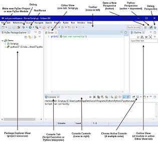

코딩에 있어서는 vim만으로 충분할 수 있습니다. 그러나 vim은 백업 그리고 버전/소스 관리에 있어서는 전혀 상관없는 툴이지요. 그 동안의 버전/소스 관리는 완벽히 수동으로, 제 손가락으로만 수행을 했던 겁니다.


이제 그만 다른 개발자들이 사용하는 개발환경에 관심을 가져도 되지 않을까 생각을 합니다. 세상에 많은 개발자들이 1991년 만들어진 vim에만 머물러 있지 않으니까요.

참고로 이 문서도 git, vscode를 이용해서 markdown 파일로 만들어 보았습니다.

# Trend

단연 Git이 가장 대표적인 버전 관리 시스템입니다. 구글에서 'version Control system'을 검색하시면, 언제나 상위에 랭크되어 있는 Git을 볼 수 있습니다. 많은 오픈 소스 프로젝트가 Github에서 개발되고 있습니다. 5GC API들을 정리해둔 5GC_APIs도 Github에 있고, 찾아보면 5G core and EPC을 C로 구현하고 있는 프로젝트(open5gs)도 있습니다.

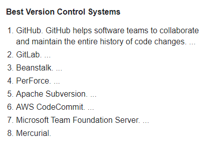

IDE 랭킹은 다음과 같습니다. 친근한 vim를 랭킹에서 찾아볼 수는 있습니다. 단 점유율 0.95%로 아주 초라한 share입니다.

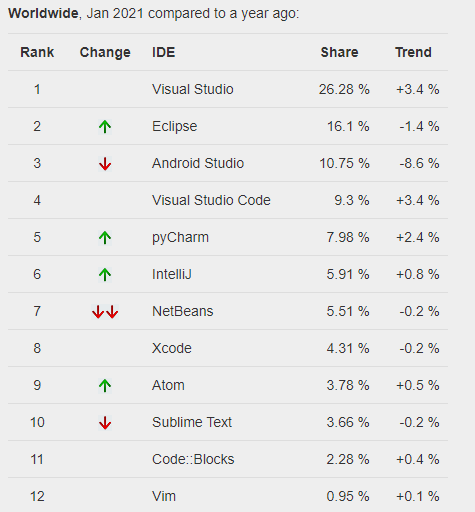

특징으로는 2014년부터 Visual Studio Code가 급성장하고 있습니다.

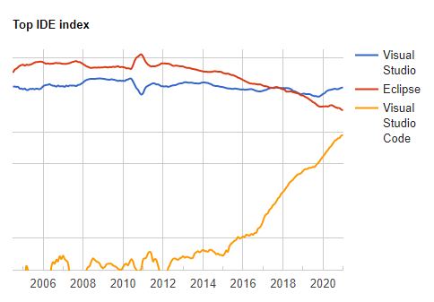

아무래도 개발환경을 새롭게 시도해 보고자 한다면, 위에 있는 목록에서 고르는 것이 trend에 맞겠다 싶습니다. 저 많은 툴들을 일일히 다 경험해 볼 수는 없으니까요.

저는 git, visual studio code를 선택했습니다. git repository를 노트북에 만들기 위해서는 리눅스가 필요해서, 노트북에 WSL2(windows subsystem for Linux)을 구성하고 우분투 리눅스도 설치했습니다.

# Git

우선 Git에 대한 간략한 소개를 하자면, Git은 리눅스를 만든 토발즈가 커널 개발을 …어쩌구 저쩌구… 역사는 필요 없으니 생략하구요. Git의 가장 큰 키워드는 세 가지입니다.

##### 버전 관리, 백업, 협업

commit을 통해서 모든 경사항들을 기록하고, branch를 따로 떼어내서 긴 버전 업그레이드를 수행할 수 있습니다. tag을 하면 원하는 내용을 표시해서 넣을 수도 있습니다. 대체로 tag는 patch와 같은 걸 기록하고, branch는 규모가 좀 되는 업그레이드에 사용합니다. diff를 지원하기 때문에 commit 간 차이를 확인할 수도 있습니다.

백업은 원격 repository를 만들어서, 또는 github, gitlab과 같은 무료 git 웹서버들을 이용하면 안전하게 백업을 해둘 수 있습니다.

협업은 각자의 repository(development repository)에서 개발된 내용을 중심이 되는 repository(bare-repository)로 push하면, 중심이 되는 repository가 중첩되지 않는 영역은 알아서 통합을 해주고, 중첩되는 부분에 대해서는 conflict를 발생시켜서 개발자들이 검토할 수 있게 도와줍니다.

##### 우리의 버전 관리, 백업, 협업

현재 우리가 작업하는 방식은 이렇습니다. 버전 관리는 이전 폴더를 *_r101라는 이름으로 복사를 해두는 것이죠. 백업은 주기적으로 다른 서버에 소스를 통째로 압축을 해서 옮겨놓는 일입니다. 협업은 '누가 include를 고쳤는가? 누가 libsrc를 고쳤는가?' 이렇게 같이 일하는 사람들에게 묻는 것이죠.


이런 작업들을 더 체계적이고 편리하게 할 수 있다면, 코드를 한번 더 검증할 수 있는 시간이 마련되고, 고객사 니즈를 한번 더 생각할 수 있는 시간이 생기고, 퇴근 시간이 더 빨라지지 않을까요? 버전 관리, 백업만이라도 크게 신경 쓰지 않아도 된다면, 큰 도움이 될 겁니다.

Git에 대한 개념과 사용방법은 인터넷에서 잘 정리된 곳들이 많으니, 이를 참고하시기 바랍니다. 저는 생활코딩의 "지옥에서 온 Git"으로 대략적인 개념을 잡았습니다. 일반인 대상 강의이기 때문에 쉽고 부담 없이 시청할 수 있습니다. 2배속으로 돌려봐도 될 정도입니다.

- 입구 수업 : [https://opentutorials.org/module/3733](https://opentutorials.org/module/3733)
- 본격 수업 : [https://opentutorials.org/course/2708](https://opentutorials.org/course/2708)

덧붙여서 Github에 대해서 언급하고 싶습니다. Git은 버전 관리 툴이고, Github는 Git을 바탕한 웹서비스입니다. Git repository 인터넷 호스팅 서비스와 WEB 인터페이스를 제공하고, 편리한 추가 기능 등을 제공해 줍니다. 아주 후려서 설명하자면, 나의 소스들을 인터넷에 안전하게, 무료로 백업(2021.1.기준)해주는 서비스입니다.

# Visual Studio Code

Visual Studio라는 이름은 익숙합니다. 가장 강력한 개발도구로 알려져 있지만, 그 규모가 저에게는 좀 부담스럽습니다. 주로 vim을 써왔으니까요. 용량의 차이, 기능의 차이, 구동 시간의 차이가 아주 큽니다. 다윗과 골리앗, 아니 골리앗과 다윈의 신발 한 짝인 셈입니다.

하지만 Visual Studio Code는 Visual Studio와 결이 많이 다릅니다. Vscode(visual studio code)는 IDE이기보다 text 편집기에 가깝습니다. 하지만 그렇다고 해서 IDE가 가지고 있는 편리함을 못 누리는 것이 아닙니다. 휴대폰에 앱을 깔듯이 extention을 설치하면, 다양한 기능을 사용할 수 있습니다.

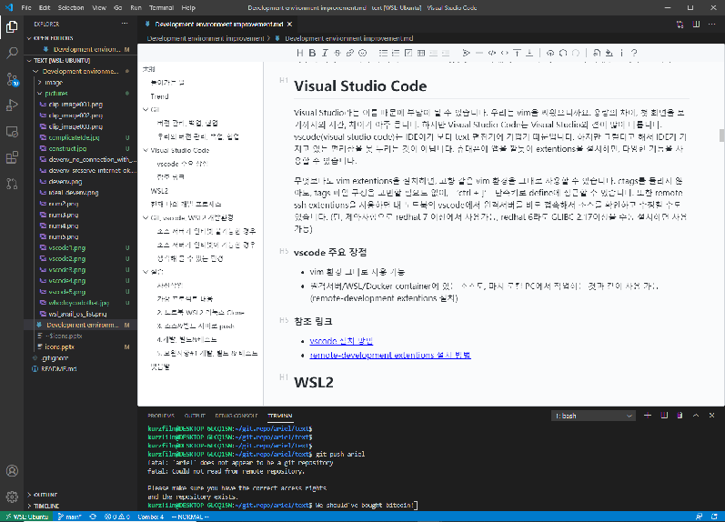

무엇보다도 vim extension을 설치하면, 고향 같은 vim 환경을 그대로 사용할 수 있습니다. ctags를 돌리지 않아도, tags 파일 구성을 고민할 필요도 없이, ‘Ctrl + ]’ 단축키로 define에 접근할 수도 있습니다. 또한 remote-development extension을 사용하면 노트북의 vscode에서 원격서버를 바로 접속해서 소스를 확인하고 수정할 수도 있습니다. (단, 제약사항으로 Redhat 7 이상에서 사용 가능, redhat6라도 GLIBC 2.17 이상을 수동 설치하면 사용 가능)

##### vscode 주요 장점

- vim 환경을 그대로 사용 가능
- 원격서버/WSL/Docker container에 있는 소스도, 마치 로컬 PC에서 작업하는 것과 같이 사용 가능(remote-development extension 설치)

##### 참조 링크

- [vscode 설치 방법](https://code.visualstudio.com/)
- [remote-development extentions 설치 방법](https://technote.kr/320)

# WSL2

Windows Subsystem for Linux은 윈도우 10에서 리눅스를 사용할 수 있는 도구입니다. 예전에는 리눅스를 사용하기 위해서 Virsual Host을 실행하고, 리눅스를 부팅해서 사용해야 했습니다. 이제는 WSL 덕분에 윈도우에서 언제나 터미널만 열면 리눅스로 접속해서 사용할 수 있습니다.

윈도우에서도 Git을 사용할 수는 있지만 사내 소스들이 리눅스 기반 소스이기 때문에, 노트북에 소스들을 저장하고 관리하기 위해서는 리눅스를 로컬에 설치해야 합니다.

아래 링크를 참조하셔서 WSL2를 설치하시면 됩니다.

* [WSL2 설치 방법](https://www.44bits.io/ko/post/wsl2-install-and-basic-usage)

# 현재 나의 개발 프로세스

노트북에서 xshell을 이용해서 소스가 있는 서버에 접속하고 vim으로 소스를 편집하고 컴파일러로 빌드를 합니다. 테스트 서버에서 ftp, rcp, scp를 사용하여 원격의 바이너리를 복사해 옵니다. 그리고 테스트를 하고, 결과를 확인합니다.

새로운 개발환경을 구성할 때, 고려할 사항으로는 소스&빌드 서버가 인터넷을 연결할 수 있는지 없는지입니다. Gibhub로 접근할 수 있는지에 따라서 구성이 달라지기 때문입니다.

* 소스 서버 인터넷 가능
* 소스 서버 인터넷 불가

# Git, Vscode, WSL2 개발환경

### 소스 서버가 인터넷 불가능한 경우

대부분이 이와 유사한 방식으로 작업을 하실 겁니다. 소스&빌드 서버와 테스트 서버가 보통은 사내 서버나 고객사 테스트 베드에 있기 때문입니다.

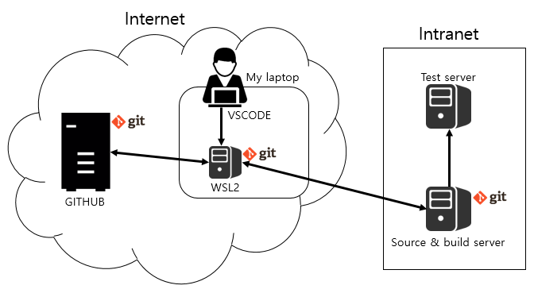

우선 노트북에는 vscode를 설치하고 WSL2 리눅스를 구성합니다. WSL2 리눅스에는 소스가 있고 Git으로 관리하죠. 주로 소스를 열람하고 편집하는 repository는 WSL2 리눅스에서 입니다. vscode의 remote-develoment extension으로 원격 연결해서 작업하면 됩니다. 마치 로컬에서 작업하는 것처럼 만들어 주죠.

소스 편집이 완료되면 Git을 이용(git push)하여, WSL2 리눅스에서 소스&빌드 서버로 변경 내용을 전달합니다. 그 이후에 빌드, 바이너리 릴리즈, 테스트는 전과 동일한 방식으로 작업합니다. 빌드를 하면서 소스&빌드 서버에서 소스를 바로 수정하고 싶은 경우도 있습니다. 그럴 때에는 소스&빌드 서버에서 작업하고 완료한 뒤에, WSL2 리눅스에서 변경사항을 소스&빌드 서버로부터 받아오면(Pull) 됩니다.

어느 정도 작업이 완료가 되고 나면, WSL2 리눅스에서 Github로 전제 변경사항을 전달(Push)합니다.

### 소스 서버가 인터넷이 가능한 경우

vscode의 remote-develoment extension으로 소스&빌드 서버에 접속을 해서 편집 및 개발 작업을 합니다. 단, 앞서 언급한 바와 같이 소스&빌드 서버가 GLIBC 2.17 이상을 사용할 수 있어야 합니다. 소스&빌드 서버와 Github는 바로 연결해서 Push/Pull을 사용하면 됩니다.

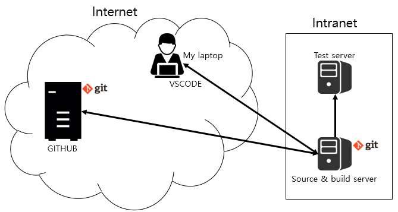

### 생각해 볼 수 있는 환경

노트북 WSL2 리눅스를 소스&빌드 서버로 사용하는 방법도 있습니다. 단순한 구조로 사용할 수 있어서 편리합니다. 하지만 많은 제약 조건이 있습니다. WSL2 리눅스가 Test server와 호환이 가능해야 합니다.

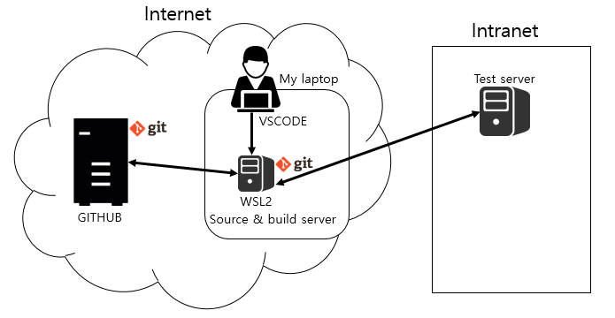

현재 WSL2로 설치가 가능한 리눅스 목록은 다음과 같습니다. 각 개발하는 OS 플랫폼에 따라서 호환 가능성은 각자 판단하시기 바랍니다.

* 무료 : Alpine WSL, Ubuntu, Debian, Kali Linux, Raft WSL, SUSE Linux
* 유료 : Fedora Remix For WSL, CentOS


# 실습

말로만 설명하기 보다는 간단히 실습할 수 있도록 구성을 하였습니다.

### 사전작업

* github 미리 가입
* 노트북 wsl2 Ubuntu 설치
* vscode 설치
* 앞선 git 강의를 시청

### 가상 프로젝트 내용

* 프로젝트 이름 : hello_ariel
* 개발사항 : "hello, ariel." 출력
* 보완사항#1(소스&빌드 서버에서 편집) : "nice to you, too." 출력

### 1. Github repository 만들기

Github에서 새로운 repository를 생성합니다. Public을 선택하면 모든 사용자에게 공개되기 때문에 Private을 선택하고, README 파일과 .gitignore 파일을 기본으로 생성하기로 합니다. .gitignore 파일은 git이 추적하지 않을 파일들의 목록입니다. C는 *.o 파일을 추적할 필요가 없기 때문에, 이런 파일들이 목록에 들어갑니다. Github에서는 언어를 선택하면 기본적인 .gitignore 목록을 만들어 줍니다. 여기에서는 C언어를 선택해서 .gitignore 파일을 생성하였습니다.

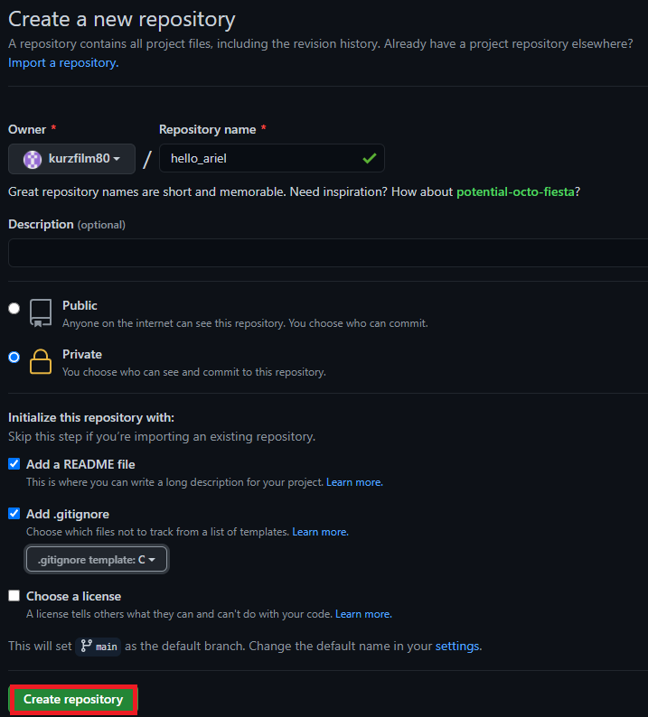

hello_ariel repository가 생성되었습니다. 이제 최초로 commit을 수행합니다.

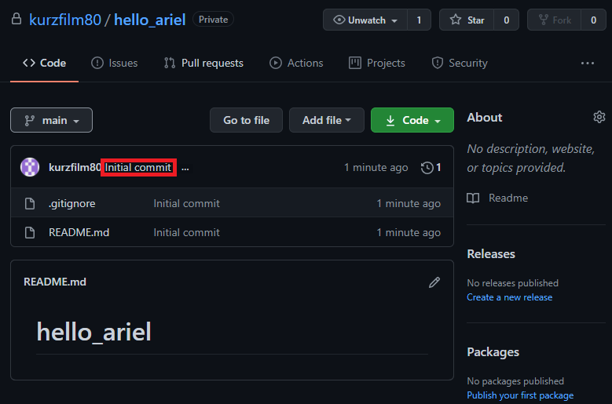

main branch에 최초 commit이 수행되었습니다.

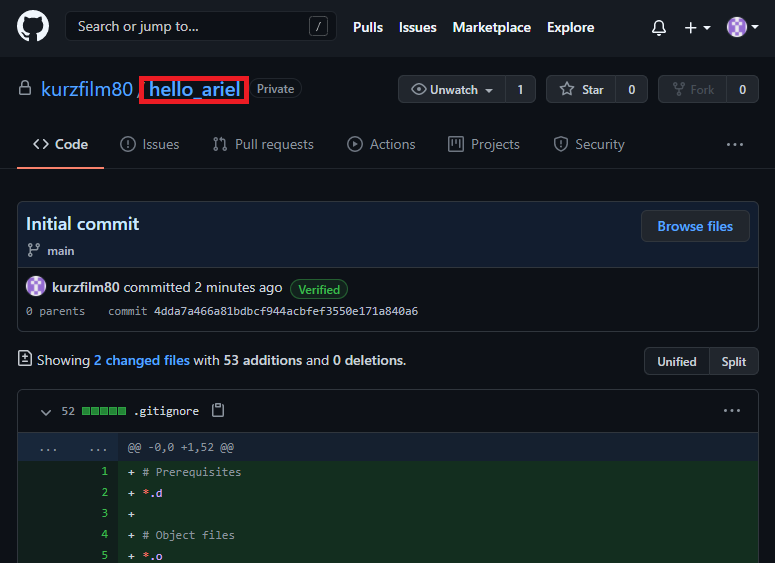

### 2. 노트북 WSL2 리눅스 Clone

github에서 clone하기 위한 https 서비스 주소를 확인합니다.

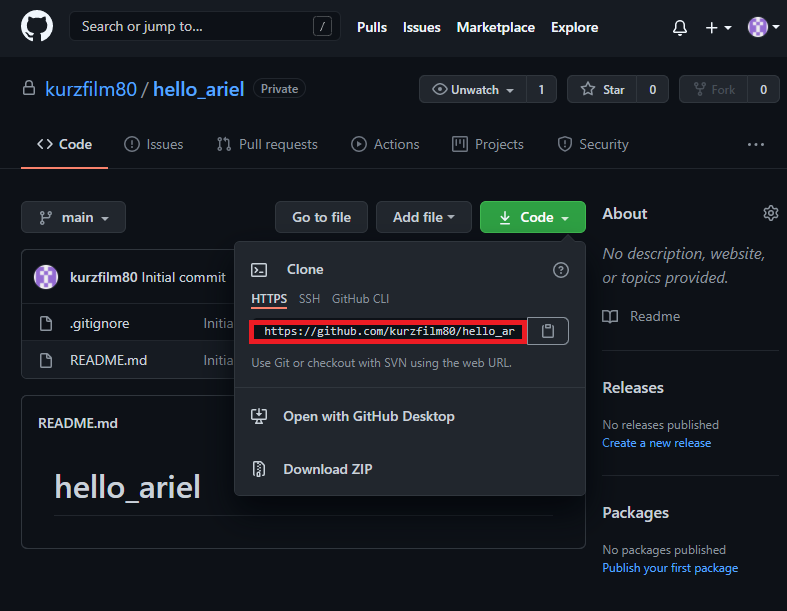

노트북 WSL2 linux로 접속하여 hello_ariel repository를 생성할 디렉토리로 이동하고, git clone을 실행하도록 합니다. git clone을 실행하면 방금 만든 github hello_ariel repository를 그대로 가져옵니다.

```bash
kurzfilm@DESKTOP-6LCQ1SN:~$ cd ~/git.repo/ariel
kurzfilm@DESKTOP-6LCQ1SN:~/git.repo/ariel$ git clone https://github.com/kurzfilm80/hello_ariel.git
Cloning into 'hello_ariel'...
Username for 'https://github.com': kurzfilm80
Password for 'https://kurzfilm80@github.com':
remote: Enumerating objects: 4, done.
remote: Counting objects: 100% (4/4), done.
remote: Compressing objects: 100% (3/3), done.
remote: Total 4 (delta 0), reused 0 (delta 0), pack-reused 0
Unpacking objects: 100% (4/4), 910 bytes | 910.00 KiB/s, done.
```

github에서 만들어둔 README.md와 .gitignore 파일을 노트북 WSL2 linux에서 확인할 수 있습니다.

```bash
kurzfilm@DESKTOP-6LCQ1SN:~/git.repo/ariel$ cd hello_ariel/
kurzfilm@DESKTOP-6LCQ1SN:~/git.repo/ariel/hello_ariel$ ls
README.md
kurzfilm@DESKTOP-6LCQ1SN:~/git.repo/ariel/hello_ariel$ ls -al
total 20
drwxr-xr-x 3 kurzfilm kurzfilm 4096 Jan 21 17:49 .
drwxr-xr-x 7 kurzfilm kurzfilm 4096 Jan 21 17:49 ..
drwxr-xr-x 8 kurzfilm kurzfilm 4096 Jan 21 17:49 .git
-rw-r--r-- 1 kurzfilm kurzfilm  430 Jan 21 17:49 .gitignore
-rw-r--r-- 1 kurzfilm kurzfilm   13 Jan 21 17:49 README.md
```

### 3. 소스&빌드 서버로 push

소스&빌드 서버에서 사용할 디렉토리를 생성하고. git init . 수행하여 이 디렉토리를 git repository로 만듭니다.

* 소스&빌드 서버

```bash
rcsga [ hsspkg ~ ] cd ~/tmp
rcsga [ hsspkg ~/tmp ] mkdir hello_ariel
rcsga [ hsspkg ~/tmp ] cd hello_ariel
rcsga [ hsspkg ~/tmp/hello_ariel ] git init .
Initialized empty Git repository in /home/hsspkg/tmp/hello_ariel/.git/
rcsga [ hsspkg ~/tmp/hello_ariel ] ls -al
total 12
drwxrwxr-x  3 hsspkg hsspkg 4096 Jan 22 09:36 .
drwxrwxr-x 14 hsspkg hsspkg 4096 Jan 22 09:35 ..
drwxrwxr-x  7 hsspkg hsspkg 4096 Jan 22 09:36 .git
```

* WSL2 리눅스 서버

WSL2 리눅스 서버에서 remote repository를 추가해 줍니다. 아래 git remote add 명령어가 remote repository를 추가하는 명령어입니다. git remote -v로 현재 원격 repository 목록을 확인할 수 있습니다. 현재에는 github에 해당하는 origin repository와 방금 추가한 ariel repository를 확인할 수 있습니다.

```bash
kurzfilm@DESKTOP-6LCQ1SN:~/git.repo/ariel/hello_ariel$ git remote add ariel hsspkg@192.168.70.236:~/tm
p/hello_ariel
kurzfilm@DESKTOP-6LCQ1SN:~/git.repo/ariel/hello_ariel$ git remote -v
ariel   hsspkg@192.168.70.236:~/tmp/hello_ariel (fetch)
ariel   hsspkg@192.168.70.236:~/tmp/hello_ariel (push)
origin  https://github.com/kurzfilm80/hello_ariel.git (fetch)
origin  https://github.com/kurzfilm80/hello_ariel.git (push)
```

이제 아무것도 없는 소스&빌드 서버의 repository로 WSL2 리눅스 repository 내용을 push합니다.

```bash
kurzfilm@DESKTOP-6LCQ1SN:~/git.repo/ariel/hello_ariel$ git push ariel
hsspkg@192.168.70.236's password:
Permission denied, please try again.
hsspkg@192.168.70.236's password:
Enumerating objects: 4, done.
Counting objects: 100% (4/4), done.
Delta compression using up to 8 threads
Compressing objects: 100% (3/3), done.
Writing objects: 100% (4/4), 930 bytes | 465.00 KiB/s, done.
Total 4 (delta 0), reused 0 (delta 0)
To 192.168.70.236:~/tmp/hello_ariel
 * [new branch]      main -> main
```

* 소스&빌드 서버

소스&빌드 서버 디렉토리르 확인하면 아무런 변화가 없을 수 있습니다.

```bash
rcsga [ hsspkg ~/tmp/hello_ariel ] ls -al
total 12
drwxrwxr-x  3 hsspkg hsspkg 4096 Jan 22 09:36 .
drwxrwxr-x 14 hsspkg hsspkg 4096 Jan 22 09:35 ..
drwxrwxr-x  8 hsspkg hsspkg 4096 Jan 22 09:40 .git
```

이유는 main branch로 checkout(입장)이 되지 않았기 때문입니다. git branch 명령어는 현재 branch 목록을 보여줍니다. 현재 checkout된 branch 앞에는 '*'가 표시가 됩니다. main branch로 checkout을 수행하면, github에서 만들었던 파일들을 확인할 수 있습니다.

```bash
rcsga [ hsspkg ~/tmp/hello_ariel ] git branch
  main
rcsga [ hsspkg ~/tmp/hello_ariel ] git checkout main
Switched to branch 'main'
rcsga [ hsspkg ~/tmp/hello_ariel ] git branch
* main
rcsga [ hsspkg ~/tmp/hello_ariel ] ls -al
total 20
drwxrwxr-x  3 hsspkg hsspkg 4096 Jan 22 09:41 .
drwxrwxr-x 14 hsspkg hsspkg 4096 Jan 22 09:35 ..
drwxrwxr-x  8 hsspkg hsspkg 4096 Jan 22 09:41 .git
-rw-rw-r--  1 hsspkg hsspkg  430 Jan 22 09:41 .gitignore
-rw-rw-r--  1 hsspkg hsspkg   13 Jan 22 09:41 README.md
```

### 4. 개발, 빌드&테스트

vscode를 실행하고 [file]-[open folder]에서 WLS2 리눅스의 hello_ariel 폴더를 open합니다.

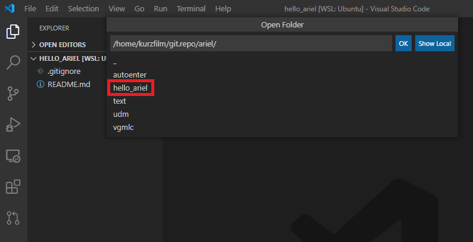

탐색기에서 기존 파일 .gitignore, README.md를 확인할 수 있습니다. main.c 파일을 추가해 줍니다.

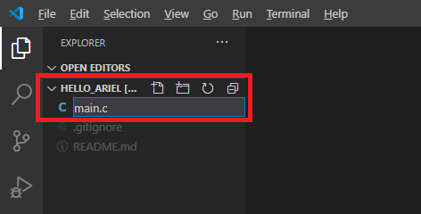

main.c 파일을 열고 hello ariel 출력 코드를 입력합니다. 빌드하고 정상적으로 출력이 되는지 확인을 합니다. 실제 개발 시에는 컴파일을 WSL2 리눅스에서 수행하기 위해서는 많은 추가 설정이 필요할 겁니다.

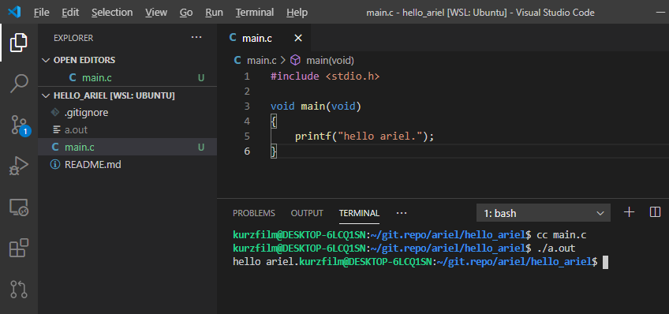

이제 현재 상태로 commit을 수행합니다. source control에서 comment를 입력하고 commit 버튼을 클릭하면 모든 변경사항이 commit 됩니다. vscode에서는 git 명령어들을 클릭만으로 편리하게 수행하고, 현재 변경된 파일 리스트, commit 후 원격 repository로 push가 수행되었는지 여부도 확인할 수 있습니다.

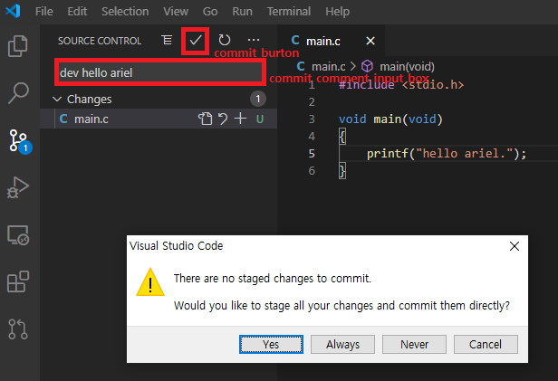

repository는 bare와 non-bare(working/development)로 구분할 수 있습니다. bare는 저장 전용 repository(github)이고, non-bare는 소스를 수정하고 작업을 하는 working/development repository라고 생각하시면 됩니다. 현재 만들어진 repository는 다음과 같습니다.


| 구분 | repository | 비고 |
| - | - | - |
| bare | github의 hello_ariel |   |
| non-bare(working/development) | WSL2 리눅스의 hello_ariel,<br /><br />소스&빌드 리눅스의 hello_ariel |   |

WSL2 리눅스에서 변경한 내용을 소스&빌드 서버로 push를 해야 하는데, non-bare 간의 push가 default로는 허용되지 않기 때문에, 이를 무시하는 옵션을 소스&빌드 서버의 .git/config에 아래와 같이 설정해야 합니다.

```bash
rcsga [ hsspkg ~/tmp/hello_ariel ] vi .git/config
[core]
	repositoryformatversion = 0
	filemode = true
	bare = false
	logallrefupdates = true
[receive]
    denyCurrentBranch = ignore
```

WSL2 리눅스에서 소스&빌드 서버 ariel repository의 main branch로 push 수행합니다.

```bash
kurzfilm@DESKTOP-6LCQ1SN:~/git.repo/ariel/hello_ariel$ git push ariel main
hsspkg@192.168.70.236's password: 
Enumerating objects: 4, done.
Counting objects: 100% (4/4), done.
Delta compression using up to 8 threads
Compressing objects: 100% (3/3), done.
Writing objects: 100% (3/3), 375 bytes | 375.00 KiB/s, done.
Total 3 (delta 0), reused 0 (delta 0)
To 192.168.70.236:~/tmp/hello_ariel
   8b14569..2921ab0  main -> main
```

소스&빌드 서버에서 main.c 추가를 확인합니다. 추가되지 않았다면, git reset --hard 명령어를 실행해서 현재 작업 헤드가 push된 마지막 commit 상태를 가르키도록 해야 합니다. git에는 working directory라는 것이 있는데, 현재 작업이 진행 중이 내용들입니다. 소스&빌드 서버에 입장에서는 다른 서버로부터 push 받은 마지막 commit 내용은 현재 작업 중인 내용과 별개입니다. 누군가 내 repository로 push를 했다고 해서 제가 작업하던 내용이 사라지면 안 되기 때문입니다. 이해하기 어려운 부분이지만 사용하다보면 자연스레 어느 정도 이해되는 것 같습니다.

```bash
rcsga [ hsspkg ~/tmp/hello_ariel ] ls
README.md
rcsga [ hsspkg ~/tmp/hello_ariel ] git reset --hard
HEAD is now at 2921ab0 dev hello ariel
rcsga [ hsspkg ~/tmp/hello_ariel ] ls -al
total 24
drwxrwxr-x  3 hsspkg hsspkg 4096 Jan 22 11:24 .
drwxrwxr-x 14 hsspkg hsspkg 4096 Jan 22 09:35 ..
drwxrwxr-x  8 hsspkg hsspkg 4096 Jan 22 11:24 .git
-rw-rw-r--  1 hsspkg hsspkg  430 Jan 22 09:41 .gitignore
-rw-rw-r--  1 hsspkg hsspkg   13 Jan 22 09:41 README.md
-rw-rw-r--  1 hsspkg hsspkg   67 Jan 22 11:24 main.c
rcsga [ hsspkg ~/tmp/hello_ariel ] cc main.c
rcsga [ hsspkg ~/tmp/hello_ariel ] a.out
```

### 5. 보완사항#1 개발, 빌드 & 테스트

* 소스&빌드 서버

소스&빌드 서버에서 보완사항#1을 개발하고 결과를 확인합니다.

```bash
rcsga [ hsspkg ~/tmp/hello_ariel ] vi main.c
#include <stdio.h>

void main(void)
{
    printf("hello ariel.\n");
    printf("nice to meet you.\n");
}
rcsga [ hsspkg ~/tmp/hello_ariel ] cc main.c
rcsga [ hsspkg ~/tmp/hello_ariel ] a.out
hello ariel.
nice to meet you.
```

git status로 변경된 내용을 확인하고, git commit을 수행합니다. commit 시에는 -a는 all을 의미하고, -m은 comment를 남기는 옵션입니다.

```bash
rcsga [ hsspkg ~/tmp/hello_ariel ] git status
# On branch main
# Changed but not updated:
#   (use "git add <file>..." to update what will be committed)
#   (use "git checkout -- <file>..." to discard changes in working directory)
#
#	modified:   main.c
#
no changes added to commit (use "git add" and/or "git commit -a")
rcsga [ hsspkg ~/tmp/hello_ariel ] git commit -am "dev nice hello"
[main d5a5b7e] dev nice hello
 Committer: hsspkg <hsspkg@rcsga.(none)>
Your name and email address were configured automatically based
on your username and hostname. Please check that they are accurate.
You can suppress this message by setting them explicitly:

    git config --global user.name "Your Name"
    git config --global user.email you@example.com

If the identity used for this commit is wrong, you can fix it with:

    git commit --amend --author='Your Name <you@example.com>'

 1 files changed, 3 insertions(+), 2 deletions(-)
rcsga [ hsspkg ~/tmp/hello_ariel ] git status
# On branch main
nothing to commit (working directory clean)
```

* WSL2 리눅스 서버

git pull 명령어로 WSL2 리눅스에서 소스&빌드 서버의 보완사항#1 commit 내용을 가져옵니다.

```bash
kurzfilm@DESKTOP-6LCQ1SN:~/git.repo/ariel/hello_ariel$ git pull ariel main
hsspkg@192.168.70.236's password: 
Permission denied, please try again.
hsspkg@192.168.70.236's password: 
remote: Counting objects: 5, done.
remote: Compressing objects: 100% (3/3), done.
remote: Total 3 (delta 1), reused 0 (delta 0)
Unpacking objects: 100% (3/3), 314 bytes | 157.00 KiB/s, done.
From 192.168.70.236:~/tmp/hello_ariel
 * branch            main       -> FETCH_HEAD
   2921ab0..d5a5b7e  main       -> ariel/main
Updating 2921ab0..d5a5b7e
Fast-forward
 main.c | 5 +++--
 1 file changed, 3 insertions(+), 2 deletions(-)
kurzfilm@DESKTOP-6LCQ1SN:~/git.repo/ariel/hello_ariel$ git status
On branch main
Your branch is ahead of 'origin/main' by 1 commit.
  (use "git push" to publish your local commits)

nothing to commit, working tree clean
kurzfilm@DESKTOP-6LCQ1SN:~/git.repo/ariel/hello_ariel$ ls
README.md  a.out  main.c
kurzfilm@DESKTOP-6LCQ1SN:~/git.repo/ariel/hello_ariel$ cat main.c
#include <stdio.h>

void main(void)
{
    printf("hello ariel.\n");
    printf("nice to meet you.\n");
}
kurzfilm@DESKTOP-6LCQ1SN:~/git.repo/ariel/hello_ariel$ cc main.c 
kurzfilm@DESKTOP-6LCQ1SN:~/git.repo/ariel/hello_ariel$ ./a.out
hello ariel.
nice to meet you.
```

개발과 보완작업#1을 마쳤으니 오늘 작업이 완료된 셈입니다. 이제 Github로 모든 내용들을 반영합니다. git push 명령어를 사용하여 Github로 반영을 합니다. 이 때 push할 대상은 Github의 main branch이기 때문에, origin main으로 push를 합니다.

```bash
kurzfilm@DESKTOP-6LCQ1SN:~/git.repo/ariel/hello_ariel$ git push origin main
Enumerating objects: 5, done.
Counting objects: 100% (5/5), done.
Delta compression using up to 8 threads
Compressing objects: 100% (3/3), done.
Writing objects: 100% (3/3), 334 bytes | 334.00 KiB/s, done.
Total 3 (delta 1), reused 0 (delta 0)
remote: Resolving deltas: 100% (1/1), completed with 1 local object.
To https://github.com/kurzfilm80/hello_ariel.git
   2921ab0..d5a5b7e  main -> main
```

* Github

Github로 돌아가서 개발 및 보완사항#1이 반영되었는지 확인한다.

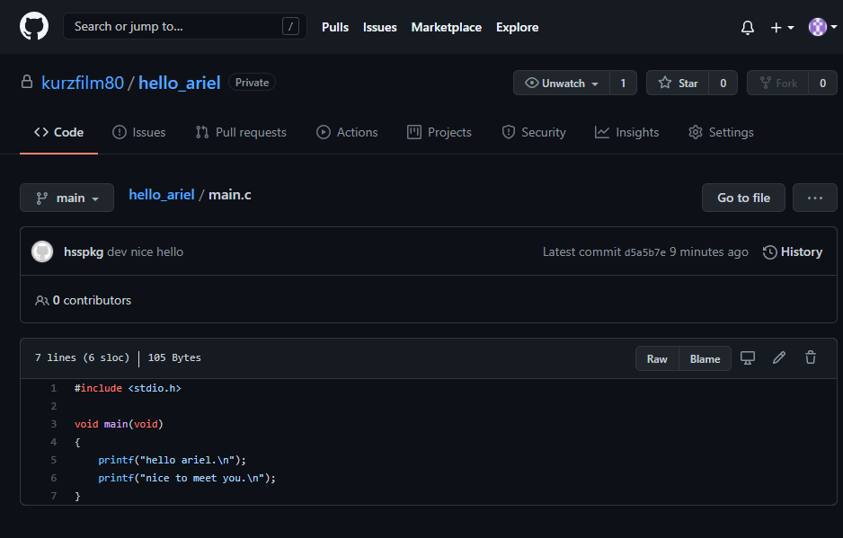

# 나가는 말

처음에는 많은 분들이 git에 매력을 느끼고 많이 사용했으면 하는 마음에서 이 글을 시작했습니다. git이라는 것이 혼자만 사용할 때도 상당히 유용하지만, 모두 함께 사용할 때 그 효용이 배가 된다고 생각하기 때문입니다. 그래서 git의 세 가지 키워드에 협업이 포함되어 있는 것이죠.

git의 매력을 충분히 어필할 수 있었는지는 모르겠습니다. 생각과 느낌을 전달하는 것이 새삼 어렵다고 느껴집니다. 사실을 전달하는 일만 해도 많은 오해가 생겨나니, 새삼이랄 것도 없겠네요.

긴 글 읽어주셔서 감사합니다.
